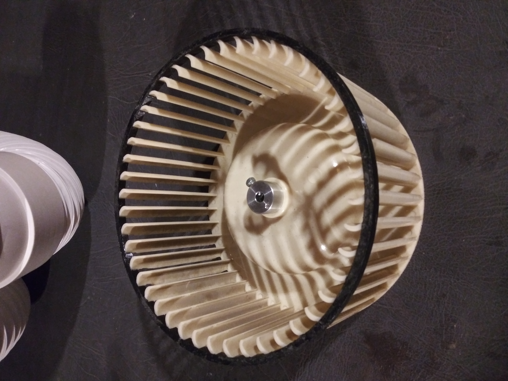
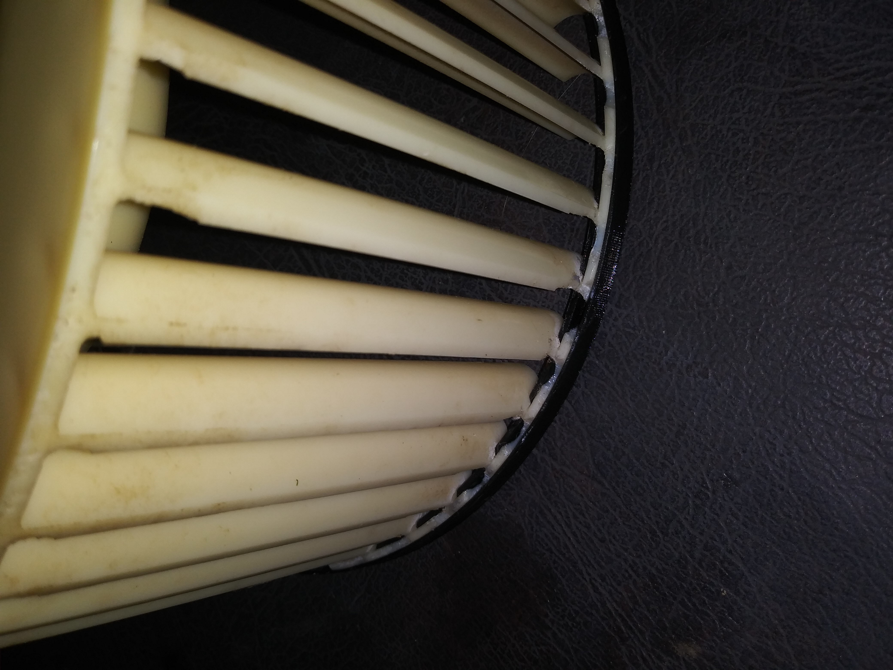

# Parametric (cadquery) model for a centrifugal fan brace

## The Story

A poor mouse got trapped inside whenever A/C was in the basement storage during winter.
It tried to eat its way out and just lacked good management skills to stay on target:
it ate lots of pieces here and there instead of one hole to escape.
As a result, wheel lost its integrity on the outer rim:

## AC Detail

Amana AP125D with he A/C (not the main blower) wheel A5304-090, which is no longer anywhere to be found.
A probable replacement fit is AC-8000-18, as e.g. available from [Appliance Factory Parts](https://www.appliancefactoryparts.com/search/part/1055514/) (if my creation falls apart -- that will be the next thing I would do - just get this one.) 

## What is here

I used an awesome [cadquery](https://cadquery.readthedocs.io/) to create a quick and dirty model for a brace which goes on top of the rim to hold it together.
I had to print a quarter and then the rest which did fit on the printing plate of my Prusa, trim both to match target size, and super glued together after ensuring a good tight fit (I did even stand on the thing for a good "pressing" - it held ;-) ).
Result:

You can see those eaten out locations braced on:

# License

CC-BY 4.0.
